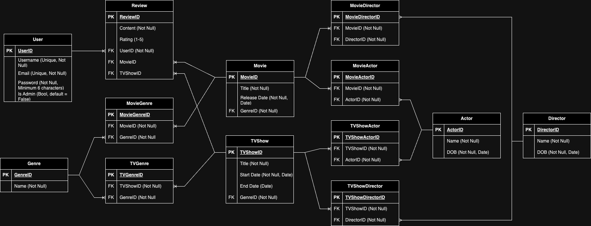

# This README contains information for the coder-academy Term 2 Assessment 2 - API.

- [GitHub repo](https://github.com/dilbot-cot/T2A2)

## Identification of the problem you are trying to solve by building this particular app.
The application aims to offer a comprehensive database of TV shows and movies. It provides detailed information about these media types, as well as the associated actors and directors. Users can also write reviews and rate these shows and movies.

## Why is it a problem that needs solving?
While other databases exist surround media reviews (IMDB and Rotten Tomatoes being the leaders) this app is a simple design allowing for quick navigation between movies and tv shows and the objects related (Actors, Genres and Directors)  
Reviews aren't skewed between 'audience scores' and 'critic scores' and allows for a more accuarte reflection of the overall viewing experience.  
The build is ripe for further expansion if more complexity or additional models are requested by the client

## Why have you chosen this database system. What are the drawbacks compared to others?
You've chosen to use SQLAlchemy with a relational database (PostgreSQL). This choice was made due to the structured data and complex queries. However, it may be slower than NoSQL databases for read-heavy operations and less flexible for handling unstructured data.

## Identify and discuss the key functionalities and benefits of an ORM
ORM (Object-Relational Mapping) simplifies interactions with the database by using Python objects instead of raw SQL queries. This approach makes code more readable and maintainable. SQLAlchemy, the ORM used in your project, also provides advanced features like lazy loading and session management.

## Endpoints
### Admin
- GET a list of all users: 'admin/user' must be logged in as administrator  
- PUT to change a users administartion permissions: 'admin/user/<id>' must be logged in as administrator, required fields 'is_admin'
- DELETE a user: 'admin/user/<id>' must be logged in as administrator  
- DELETE a actor: 'admin/actor/<id>' must be logged in as administrator  
- DELETE a director: 'admin/director/<id>' must be logged in as administrator  
- DELETE a genre: 'admin/genre/<id>' must be logged in as administrator  
- DELETE a movie: 'admin/movie/<id>' must be logged in as administrator  
- DELETE a TV Show: 'admin/tv_show/<id>' must be logged in as administrator  
- DELETE a review: 'admin/review/<id>' must be logged in as administrator
### Actors
- GET a List all actors: 'actors/'
- GET a specific actor details: 'actors/<id>'
- POST a new actor: 'actors/' must be logged in as user mandatory fields: 'name' 'dob' optional fields: 'movie.id' 'tv_show.id'
- PUT a movie relationship: 'actors/<id>/movie' must be logged in as a user mandatory fields: 'movie.id'
- PUT a TV Show relationship: 'actors/<id>/tv' must be logged in as a user mandatory fields: 'tv_show.id'
### Directors
- GET a List all directors: 'directors/'
- GET a specific director details: 'directors/<id>'
- POST a new director: 'directors/' must be logged in as user mandatory fields: 'name' 'dob' optional fields: 'movie.id' 'tv_show.id'
- PUT a movie relationship: 'directors/<id>/movie' must be logged in as a user mandatory fields: 'movie.id'
- PUT a TV Show relationship: 'directors/<id>/tv' must be logged in as a user mandatory fields: 'tv_show.id'
### Genres
- GET a list all of all Genres: 'genres/'
- GET a specific genre details: 'genres/<id>'
- POST a new genre: 'genres/' must be logged in as user mandatory fields: 'name'
### Movies
- GET a list all movies: 'movies/'
- GET a specific movie details: 'movies/<id>'
- POST a new movie: 'movies/' must be logged in as user mandatory fields: 'title' 'release_date' optional fields: 'actor.id' 'director.id' 'genre.id'
- PUT an actor relationship: 'movies/<id>/actor' must be logged in as user mandatory fields: 'actor.id'
- PUT a director relationship: 'movies/<id>/director' must be logged in as user mandatory fields: 'director.id'
- PUT a genre relationship: 'movies/<id>/genre' must be logged in as user mandatory fields: 'genre.id'
### TV Shows
- GET a list of all TV Shows: 'tv_shows/'
- GET a specific TV Show details: 'tv_shows/<id>'
- POST a new TV Show: 'tv_shows/' must be logged in as user mandatory fields: 'title' 'start_date' optional fields: 'end_date' 'actor.id' 'director.id' 'genre.id'
- PUT an actor relationship: 'tv_shows/<id>/actor' must be logged in as user mandatory fields: 'actor.id'
- PUT a director relationship: 'tv_shows/<id>/director' must be logged in as user mandatory fields: 'director.id'
- PUT a genre relationship: 'tv_shows/<id>/genre' must be logged in as user mandatory fields: 'genre.id'
- PUT an end date: 'tv_shows/<id>/end_date' must be logged in as user mandatory fields: 'end_date'
### Users
- GET all reviews written by logged in user: 'user/reviews' must be logged in as user
- POST a new user: 'user/reg' mandatory fields: 'username' 'email' 'password'
- POST a login (to obtain bearer token): 'user/auth' mandatory fields: 'username' 'password'
- DELETE self: 'user/' must be logged in
### Reviews
- POST a new review: 'review/' must be logged in mandaotry fields: 'content' mandatory exclusivly 'movie.id' or 'tv_show.id' optional field: 'rating'
- DELETE a posted review: 'review/<id>' must be logged in

## ERD


## Third party services used
Flask for the web framework
SQLAlchemy for ORM
JWT for authentication
Marshmallow for object serialization
BCrypt for password hashing

## Project models and relationships
- User: Contains information about registered users has relationship with reviews.
- Movie: Stores data about individual movies. Has relationships with actors, directors, genres, and reviews.
- TV Show: Similar to the Movie model but for TV shows.
- Actor: Stores information about actors. Related to multiple movies and TV shows.
- Director: Similar to the Actor model but for directors.
- Review: Contains user reviews and ratings for movies and TV shows.
- Many-to-many relationships are managed through join tables, allowing for more complex queries and reports.

## Database relations to be implemented
- Actor table: actors_id = Primary Key
- Director table: directors_id = Primary Key
- Genres table: genres_id = Primary Key
- Movie_actors table: actors_id = Foreign Key, movies_id = Foreign Key
- Movie_directors table: directors_id = Foreign Key, movies_id = Foreign Key
- Movie_genres table: genres_id = Foreign Key, movies_id = Foreign Key
- Movies table: movies_id = Primary Key
- Reviews table: reviews_id = Primary Key, movies_id = Foreign Key, tv_shows_id = Forign Key, users_id = Foreign Key
- Tv_actors table: actors_id = Foreign Key, tv_shows_id = Foreign Key
- Tv_directors table: directors_id = Foreign Key, tv_shows_id = Foreign Key
- Tv_genres table: genres_id = Foreign Key, tv_shows_id = Foreign Key
- Tv_shows table: tv_shows_id = Primary Key
- Users table: user_id = Primary Key

## How tasks are allocated and tracked
Trello board identifying key milestones and due dates.  
In this example all tasks allocated to a single developer to complete with no supervision.  
Agile framework used in respect to constant test and refinement, however as single user project no formal standups required.

## How to setup on local machine:

Check if you have python3 installed by running command
```python3 --version```
in terminal or cmd. If you receive a version number skip to step 4, otherwise continue.
- For macOS:
1. Check if homebrew is installed by running command:
```
brew --version
```
If you recieve a version number skip to step 3.  

2. Install homebrew by running command:
```
/bin/bash -c "$(curl -fsSL https://raw.githubusercontent.com/Homebrew/install/HEAD/install.sh)"
```

3. Install python3 running command:
```
brew install python3
```

- For Windows:
1. The simplest way to install python3 is through the windows store, however you can also install using Chocolatey:
2. Install Chocolatey by running command prompt as administrator and entering command:
```
@"%SystemRoot%\System32\WindowsPowerShell\v1.0\powershell.exe" -NoProfile -InputFormat None -ExecutionPolicy Bypass -Command "[System.Net.ServicePointManager]::SecurityProtocol = 3072; iex ((New-Object System.Net.WebClient).DownloadString('https://chocolatey.org/install.ps1'))" && SET "PATH=%PATH%;%ALLUSERSPROFILE%\chocolatey\bin"
```
3. Install python3 running command:
```
choco install python
```
4. Download the GitHub repo onto your local machine
5. Navigate to the location of the src directory and run the following commands:
```
python3 -m venv venv && source venv/bin/activate && pip install -r requirements.txt
```
6. Setup a database for this project to persist in, this was built with postgresql in mind. Make sure to create an admin user to this database with all priviledges and public schemas
7. create files .env and .flaskenv (if running on local machine), follow the examples to load your environment details and pass the details of the admin user in the previous step.
8. Run commands
```
flask db drop && flask db create && flask db seed && flask run
```
in future itterations you will need only ```flask run``` however on first load this ensure all tables are empty before the tables are creates and some default users created.  
**NOTE:** the seeded administrator user has username 'admin' and password 'admin1234' if you intend to have this in production it is highly recommended to update this.